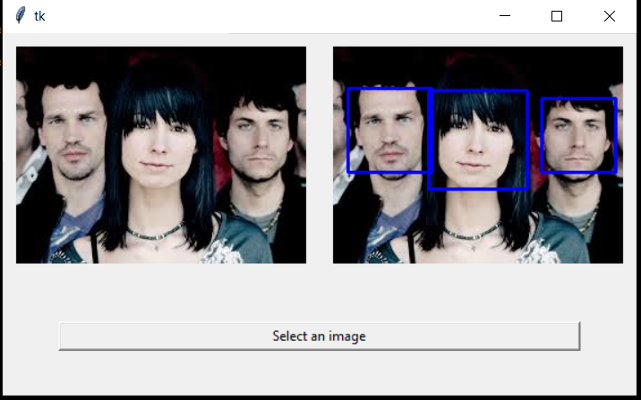

## Haar cascade face detection 
> It is a simple face detection

## Tech used:
* Computer Vision
* Tkinter

## Run as follows:

` python gui.py`

## Select an image 

## After selection Original image v/s Face detected Image is displayed 
